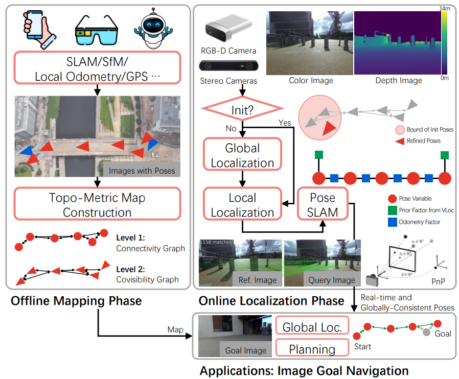
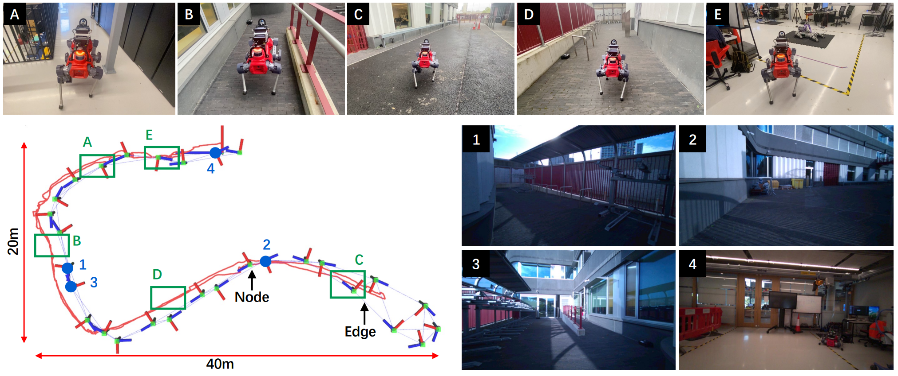

## LiteVloc: Map-Lite Visual Localization for Image-Goal Navigation 
Accepted by ICRA2025

### Overview of LiteVloc
LiteVLoc is a **hierarchical visual localization** framework designed to enable efficient and robust camera pose estimation using lightweight topometric maps. Our goal is for this package to serve as a foundational tool for scalable navigation, empowering researchers and developers to build advanced robotic systems with ease.


<div align="center">
    <a href="">
      
    </a>
</div>
<br>

We use the AR glass to create a lightweight topometric map for camera pose estimation and path planning. We can show an image as a goal (like the picture previously captured by your friend) a to the robot, and the robot can autonomously guide you to navigate to the goal. Please check our [paper](https://arxiv.org/abs/2410.04419) for the technical details and [website](https://rpl-cs-ucl.github.io/LiteVLoc/) for more demonstrations.
<div align="center">
    <a href="">
      
    </a>
</div>

<div align="center">
    <a href="">
      
    </a>
</div>


### Requirements
Create the workspace
```bash
mkdir -p catkin_ws/src/
cd catkin_ws/src/
```
Create conda environment
```bash
conda create --name litevloc python=3.8
conda activate litevloc
```
Install ```image-matching-methods```
```bash
git clone git@github.com:gogojjh/image-matching-models.git --recursive
cd image-matching-models && python -m pip install -e .
```
Install  ```VPR-evaluation-methods```
```bash
git clone git@github.com:gogojjh/VPR-methods-evaluation.git
```
Create conda environment (NVIDIA GeForce RTX 4090 and CUDA 11.8)
```bash
git clone https://github.com/RPL-CS-UCL/litevloc_code
conda install pytorch=2.0.1 torchvision=0.15.2 pytorch-cuda=11.8 numpy=1.24.3 -c pytorch -c nvidia # use the correct version of cuda for your system
pip install -r requirements.txt
```
Enter this code to check whether torch-related packages are installed
```bash
python test_torch_install.py
```
Build LiteVloc as the ROS package (optional)
```bash
catkin build litevloc -DPYTHON_EXECUTABLE=$(which python)
```

### We provide several usage of LiteVloc
1. [Instruction in Performing Map-free Benchmarking](doc/instruction_map_free_benchmark.md)
2. [Instruction in Running LiteVloc with Offline Data](doc/instruction_vloc_data.md)
3. [Instruction in Running LiteVloc with Simulated Matterport3d Environment](doc/instruction_vnav_simu_matterport3d.md)

### Issues
Issue: ```cannot import name 'cache' from 'functools'```
> Replace the original code with [Link](https://stackoverflow.com/questions/66846743/importerror-cannot-import-name-cache-from-functools)
```bash
from functools import lru_cache
@lru_cache(maxsize=None)
    def xxx
```
Issue: ```/lib/aarch64-linux-gnu/libp11-kit.so.0: undefined symbol: ffi_type_pointer, version LIBFFI_BASE_7.0``` using cv_bridge
> Change the ```.so```. Complete tutorial is shown [here](https://blog.csdn.net/qq_38606680/article/details/129118491)
```bash
rm /Rocket_ssd/miniconda3/envs/litevloc/lib/libffi.so.7
ln -s /usr/lib/aarch64-linux-gnu/libffi.so.7 /Rocket_ssd/miniconda3/envs/litevloc/lib/libffi.so.7
```
```bash
/Rocket_ssd/miniconda3/envs/litevloc/lib/libtiff.so.5
ln -s /usr/lib/x86_64-linux-gnu/libtiff.so.5 /Rocket_ssd/miniconda3/envs/litevloc/lib/libtiff.so.5
```
Issue: ```ImportError: /lib/aarch64-linux-gnu/libgomp.so.1: cannot allocate memory in static TLS block```
> Set this in the bash file: ```export LD_PRELOAD=/usr/lib/aarch64-linux-gnu/libgomp.so.1```

### Acknowledgement

```bibtex
@inproceedings{jiao2025litevloc,
  title = {LiteVLoc: Map-Lite Visual Localization for Image Goal Navigation},
  author = {Jiao, Jianhao and He, Jinhao and Liu, Changkun and Aegidius, Sebastian and Hu, Xiangcheng and Braud, Tristan and Kanoulas, Dimitrios},
  booktitle = {International Conference on Robotics and Automation (ICRA)},
  pages = {},
  year = {2025},
  organization = {IEEE},
  doi = {},
  url = {},
  video = {https://youtu.be/3udVK6HFk6M},
  dimensions = {true},
}
```

### Related Works (TODO ...)

```bibtex
This work was supported by the UKRI FLF [MR/V025333/1] (RoboHike).
For the purpose of Open Access, the author has applied a CC BY public copyright license to any Author Accepted Manuscript version arising from this submission.
Prof.Dimitrios Kanoulas is also with Archimedes/Athena RC, Greece.
```


 
