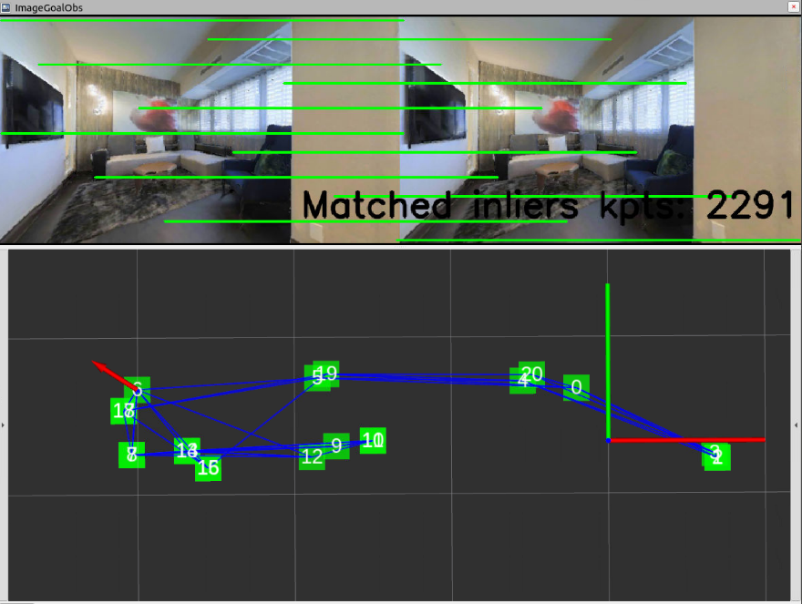

## Instraction of Running LiteVloc with Offline Data

### Prepare the Pre-Built Map for Three Matterport3d Environments
Please download [matterport3d_map](https://drive.google.com/drive/folders/1GFHUTVhlJrj8mtfjfEqrKMz3JfawEHA6?usp=drive_link) in your folder. The data is structured as follows:
```bash
matterport3d/s17DRP5sb8fy/merge_finalmap/ # 17DRP5sb8fy is the environment id
  seq/000000.color.jpg       # color image 
      000000.depth.png       # depth image, each pixel is a uint16 value with mm unit
      000000.semantic.png    # semantic image
  preds/viz_graph.png        # visualization of the graph with three edge types
  goal_images/goal_img_X.jpg # goal images
  intrinsics.txt             # camera intrinsics (fx, fy, cx, cy, width, height)
  poses.txt                  # poses of each image represented as the map-free format (qw qx qy qz tx ty tz)
  poses_abs_gt.txt           # GT poses of each image represented as the map-free format (qw qx qy qz tx ty tz)
  timestamps.txt             # timestamps of each image
  edge_covis.txt             # edges between nodes to indicate covisibility relation (0: low visibility, 1: high visibility)
  edge_odom.txt              # edges between nodes to indicate odometry relation (connection means that nodes are closed)
  edge_trav.txt              # edges between nodes to indicate traversability relation (connection means that nodes are traversable)
  database_descriptors.txt   # 256-dimension CosPlace VPR global descriptors of each image
  gps_data.txt               # GPS data
  iqa_data.txt               # image quality score (0: bad quality due to low light, motion blur, etc, 100: high quality)
```

### Build LiteVloc as the ROS Package
Follow the [tutorial](../README.md) to install **LiteVloc** for visual localization.
Modify ```env_id``` and ```map_path``` in ```run_vloc_offline_files.launch``` to your environment id and map path, then run
```bash
conda activate litevloc
catkin build litevloc -DPYTHON_EXECUTABLE=$(which python)
roslaunch litevloc run_vloc_offline_files.launch
```
You will see similar outputs as follows:
```bash
Loading observation seq/000000.color.jpg
[INFO] [1745440727.584944]: Global localization costs: 0.000s
[WARN] [1745440727.586771]: Found VPR Node in global position: 0
[INFO] [1745440727.588302]: Keyframe candidate: 1(1.06) 3(1.02) 5(1.15) 19(1.16) 20(0.87) 0(0.00) Closest node: 0
[INFO] [1745440727.856415]: Number of matched inliers: 2229
[INFO] [1745440727.857266]: Image matching costs:  0.269s
[WARN] [1745440727.860715]: [Succ] sufficient number 2229 solver inliers
[INFO] [1745440727.861090]: Local localization costs: 0.273s
[INFO] [1745440727.861476]: Groundtruth Poses: [-0.60591018  1.01205952  1.        ]
[INFO] [1745440727.861817]: Estimated Poses: [-0.605915    1.0120701   0.99999773]
```
Change ```use_rviz``` as ```true``` to visualize the results in rviz:
> The green squares and blue lines indicates the graph nodes and traversability edges, respectively. 
> The red arrow indicates the estimated pose (arrow direction is the x-axis).
<div align="center">
    <a href="">
      
    </a>
</div>