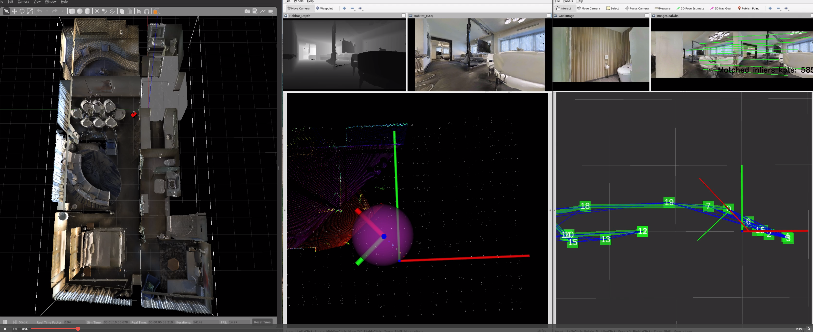

## Instraction of Running Visual Navigation with Real Robots

### Explanation of Input and Output of Each Module in ROS
**ros_loc_pipeline.py**
```bash
Subscribe: 
    /color/camera_info: synchonrized camera info
    /color/image: synchonrized undistorted color image
    /depth/image: synchonrized undistorted depth image
Publish:
    /graph: topo-matrix map
    /graph/poses: position and orientation of each node of the topo-matrix map
    /vloc/odometry: low-rate vloc pose in vloc_map frame
    /vloc/path: visualize /vloc/odometry as path
    /vloc/path_gt: gt pose visualized as path (if available)
    /vloc/image_map_obs: image matching between the reference and query
```
**ros_pose_fusion.py**
```bash
Subscribe:
    /local/odometry: high-rate odometry from visual odometry/inertial odometry/wheel encoder ...
    /global/odometry: low-rate odometry from visual localization
Publish:
    /pose_fusion/odometry: real-time and high-rate odometry from pose SLAM
    /pose_fusion/path: visualize /pose_fusion/odometry as path
    /pose_fusion/path_opt: low-rate odometry after the batch optimization from pose SLAM
```

### Use
Run VLoc with pose fusion
```bash
roslaunch topo_loc run_vloc_online_anymal.launch env_id:=ops_lab use_rviz:=false use_nav:=false vloc_freq:=0.5
```


<!-- ### Installation
1. Setup your ROS workspace
    ```shell-script
    mkdir -p catkin_ws/src && cd catkin_ws/src
    ```
2. Install the [CMU Navigation Stack](https://www.cmu-exploration.com/)
    ```
    git clone https://github.com/HongbiaoZ/autonomous_exploration_development_environment.git
    git checkout noetic-matterport
    catkin build
    ```
3. Install the [iPlanner_path_follow](https://github.com/MichaelFYang/iplanner_path_follow.git)
    * NOTE: we use this **path_follow** instead of the one in **CMU Navigation Stack** since visual navigation uses cameras with limited FoV for perception. The robot needs to turn around to go back.
    ```
    git clone https://github.com/MichaelFYang/iplanner_path_follow.git
    catkin build iplanner_path_follow
    ```
3. Install the Matterport3D Environment
    * Download [havitat-sim](https://github.com/facebookresearch/habitat-sim) and follow this [tutorial](https://drive.google.com/file/d/1xV3L2xW4JtPMZpY8t43aqlXDhraZYLDi/view) for the usage.
      ```
      python2 download_map.py --type matterport_mesh -o path_to_matterport
      python2 download_map.py --task_data habitat -o path_to_matterport
      ```
    * Another option for the [installation](https://github.com/jizhang-cmu/cmu_vla_challenge_matterport)
    * If you meet this issue: ```SystemError: initialization of _internal failed without raising an exception```
      ```
      pip uninstall numpy numba
      pip install numba numpy==1.22 --ignore-installed llvmlite
      ```
4. Install the benchmark_visual_nav which is used to launch CMU Navigation Stack with various types of environments
    * Clone
      ```
      git clone https://github.com/RPL-CS-UCL/benchmark_visual_nav.git
      catkin build benchmark_visual_nav
      ```
    * Create a data folder in the repo
      ```
      mkdir -p benchmark_visual_nav/data/matterport/17DRP5sb8fy
      ```
      * You can first use the [tutorial](https://drive.google.com/file/d/1xV3L2xW4JtPMZpY8t43aqlXDhraZYLDi/view) to structure your environment, then modify ```<uri>model://meshes/matterport.dae</uri>``` to specify your path in ```model.sdf```
5. Install the navigation interface (for planning-only)
    * Clone
      ```
      git clone https://github.com/RPL-CS-UCL/navigation_interface.git
      catkin build navigation_interface
      ```
### Running the CMU Navigation Stack in Matterport3d
1. Start the environment
    ```
    roslaunch benchmark_visual_nav system_17DRP5sb8fy.launch useLocalPlanner:=true gazebo_gui:=false
    ```
2. Run habitat_sim to render image
    ```
    cd cmu_autonomous_exploration_development/src/segmentation_proc/scripts
    conda activate habitat
    export PATH_ENV=benchmark_visual_nav/matterport/17DRP5sb8fy/navigation_environment/segmentations/matterport.glb
    python habitat_online_v0.2.1.py --scene $PATH_ENV
    ```
3. You can see these output
<div align="center">
    <a href="">
      
    </a>   
</div>

### Running the Visual Navigation in Matterport3d (including Staring the Environment)
NOTE: using the proposed **visual localization** and **iPlanner** instead
1. Run habitat_sim to render image
    ```
    cd cmu_autonomous_exploration_development/src/segmentation_proc/scripts
    conda activate habitat
    export PATH_ENV=benchmark_visual_nav/matterport/17DRP5sb8fy/navigation_environment/segmentations/matterport.glb
    python habitat_online_v0.2.1.py --scene $PATH_ENV
    ```
2. Run the visual localization
    ```
    conda activate topo_loc
    roslaunch topo_loc run_vloc_online_simuenv.launch env_id:=17DRP5sb8fy map_path:=data_topo_loc/matterport3d/vloc_17DRP5sb8fy/out_map/ use_nav:=true
    ```
3. Run the iPlanner
    ```
    conda activate iplanner
    roslaunch benchmark_visual_nav iplanner.launch config:=vehicle_sim_vloc
    ```
4. You can see these output
<div align="center">
    <a href="">
      
    </a>
</div> -->
