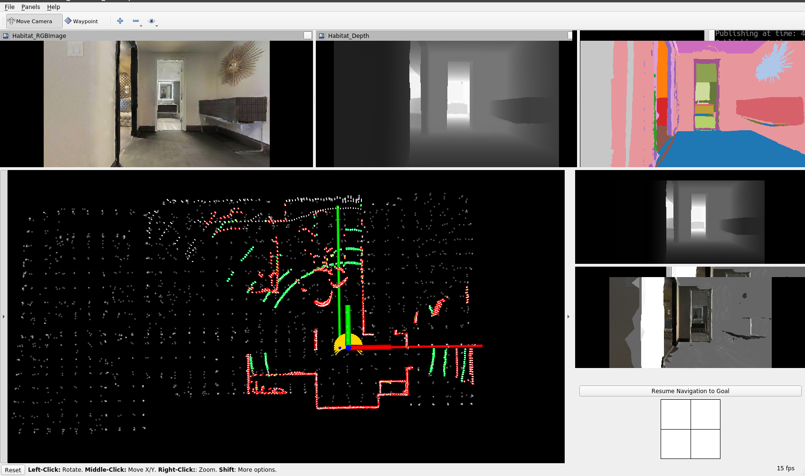
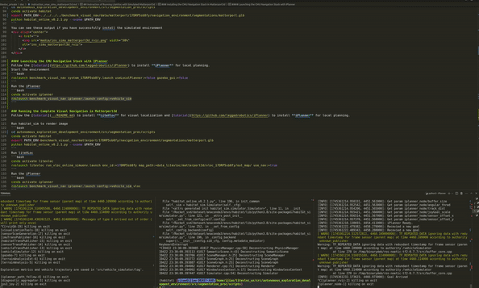
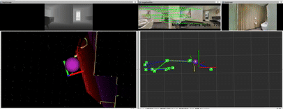

## Instraction of Running LiteVloc with Simulated Matterport3d

This repository provides a setup for visual navigation using ROS, the CMU Navigation Stack, IPlanner, and the Matterport3D environment. Follow the steps below to configure your workspace and dependencies.

---

### Tested with These Prerequisites
- **ROS Noetic** (other versions may require adjustments)
- **Python 3.8** (tested with this version)
- **OpenCV** and `cv_bridge`
- Basic ROS workspace setup (`catkin_ws`).

---

### Installing the CMU Navigation Stack in Matterport3d
Create a ROS workspace
```bash
mkdir -p ~/catkin_ws/src
cd ~/catkin_ws/src
```
Clone the CMU navigation stack (some settings were changed)
```bash
git clone git@github.com:RPL-CS-UCL/autonomous_exploration_development_environment.git
cd autonomous_exploration_development_environment
git checkout noetic-matterport-anymal_dev
```
Clone the iPlanner path-follow package (modified for visual navigation)
```bash
git clone https://github.com/MichaelFYang/iplanner_path_follow.git
```
Clone the navigation interface and benchmark_visual_nav
```bash
git clone git@github.com:RPL-CS-UCL/navigation_interface.git
git clone git@github.com:RPL-CS-UCL/benchmark_visual_nav.git
```
Install other dependencies
```bash
sudo apt install ros-noetic-diagnostic-aggregator
```

#### Setup Matterport3D Environment
Follow the instructions in the [CMU VLA Challenge Repository](https://github.com/jizhang-cmu/cmu_vla_challenge_matterport) to download models from Matterport3D and install the habitat engine. Or use this simple command
```bash
conda create --name habitat python=3.8
conda activate habitat
conda install habitat-sim==0.2.1  -c conda-forge -c aihabitat
pip install numba==0.58.1 numpy==1.24.0
```

And move the environemnt files to `benchmark_visual_nav/data/matterport/{env_id}`. An example is shown below:
```bash
benchmark_visual_nav/data/matterport/17DRP5sb8fy
    navigation_environment/meshes/
    navigation_environment/preview/
    navigation_environment/segmentation/
    log/
    matterport.world
    model.conf
    model.sdf
```
Please update the model path in `model.sdf` to point to your Matterport data 
```bash
<uri>model://meshes/matterport.dae</uri>
```
If you encounter `SystemError: initialization of _internal failed`, fix numpy/numba:
```bash
pip uninstall numpy numba
pip install numba numpy==1.22 --ignore-installed llvmlite
```

#### Build ROS Packages
Compile all ROS packages with `catkin build`:
```bash
cd ~/catkin_ws
catkin build \
    sensor_scan_generation velodyne_simulator vehicle_simulator joy ps3joy \
    terrain_analysis terrain_analysis_ext \
    local_planner visualization_tools \
    waypoint_example waypoint_rviz_plugin teleop_rviz_plugin \
    iplanner_path_follow \
    navigation_interface \
    benchmark_visual_nav \
    -DPYTHON_EXECUTABLE=$(which python)
```

#### Launching the CMU Navigation Stack in Matterport3d
Start the environment
```bash
roslaunch benchmark_visual_nav system_17DRP5sb8fy.launch useLocalPlanner:=true gazebo_gui:=false
```
Run habitat_sim to render image (python)
```bash
cd autonomous_exploration_development_environment/src/segmentation_proc/scripts
conda activate habitat
export PATH_ENV=../../../../benchmark_visual_nav/data/matterport/17DRP5sb8fy/navigation_environment/segmentations/matterport.glb
python habitat_online_v0.2.1.py --scene $PATH_ENV
```
You can see these output if you have successfully install the simulated environment
<div align="center">
    <a href="">
      
    </a>   
</div>

#### Launching the CMU Navigation Stack with IPlanner
Follow the [tutorial](https://github.com/leggedrobotics/iPlanner) to install **iPlanner** for local planning.
Start the environment
```bash
roslaunch benchmark_visual_nav system_17DRP5sb8fy.launch useLocalPlanner:=false gazebo_gui:=false
```
Run the iPlanner
```bash
conda activate iplanner
roslaunch benchmark_visual_nav iplanner.launch config:=vehicle_sim
```
<div align="center">
    <a href="">
      
    </a>
</div>


### Running the Complete Visual Navigation in Matterport3d
Follow the [tutorial](../README.md) to install **LiteVloc** for visual localization.

Run habitat_sim to render image
```bash
cd autonomous_exploration_development_environment/src/segmentation_proc/scripts
conda activate habitat
export PATH_ENV=benchmark_visual_nav/data/matterport/17DRP5sb8fy/navigation_environment/segmentations/matterport.glb
python habitat_online_v0.2.1.py --scene $PATH_ENV
```
Run LiteVLoc
```bash
conda activate litevloc
roslaunch litevloc run_vloc_online_simuenv.launch \
  env_id:=17DRP5sb8fy \
  map_path:=data_litevloc/vnav_eval/matterport3d/s17DRP5sb8fy/merge_finalmap/ \
  useLocalPlanner:=false \
  use_nav:=true
```
Run the iPlanner
```bash
conda activate iplanner
roslaunch benchmark_visual_nav iplanner.launch config:=vehicle_sim_vloc
```
4. You can see these output
<div align="center">
    <a href="">
      
    </a>
</div>
