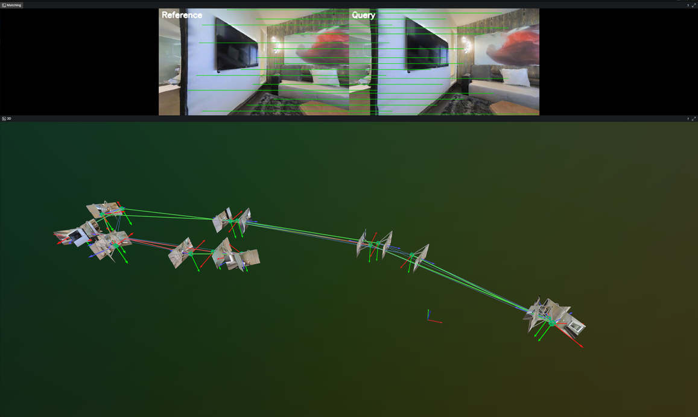
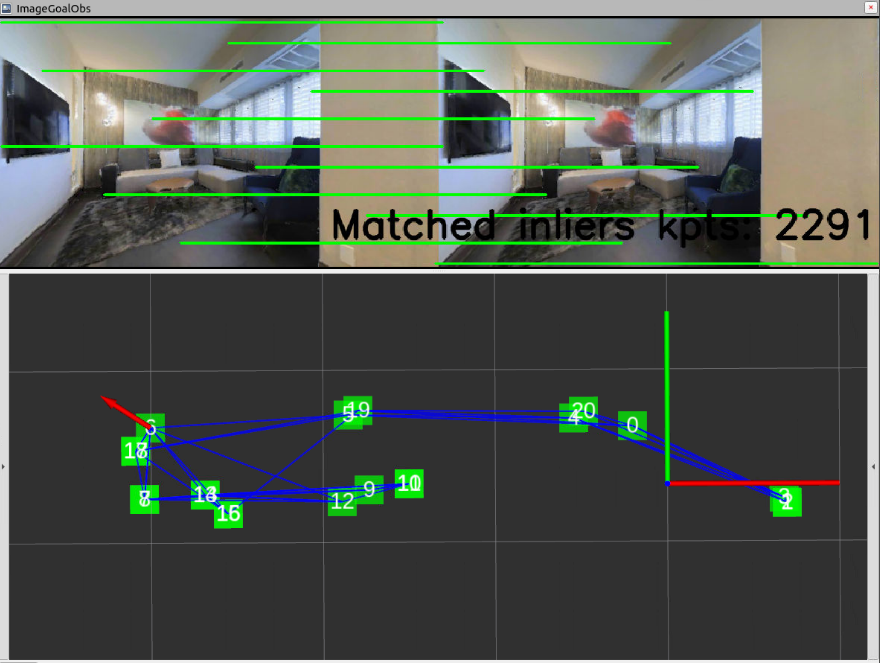

# LiteVLoc Offline Visual Localization

Two usage modes: **ROS** (with RViz) or **Rerun** (no ROS dependency, `.rrd` visualization).

---

## Data Preparation

Download the pre-built Matterport3D maps: [Google Drive](https://drive.google.com/file/d/1UA3eRKyYqZmMG1X8Rj_PJi7um_frFb7s/view?usp=sharing)

Each environment directory contains:
```
s<ENV_ID>/merge_finalmap/
├── seq/                        # RGB-D frames (color.jpg, depth.png)
├── intrinsics.txt              # fx fy cx cy width height
├── poses.txt                   # qw qx qy qz tx ty tz
├── database_descriptors.txt    # 256-d CosPlace VPR descriptors
├── edges_covis.txt             # Covisibility edges
├── edges_trav.txt              # Traversability edges
└── timestamps.txt              # Image timestamps
```

---

## Method A: Rerun (No ROS)

```bash
cd /Titan/code/robohike_ws/src/litevloc_code
conda activate litevloc

# Run pipeline → outputs .rrd
bash litevloc_code/scripts/run_vloc_offline_rerun.sh s17DRP5sb8fy

# View results
rerun litevloc_code/output/vloc_s17DRP5sb8fy.rrd
```

Supported envs: `s17DRP5sb8fy`, `sB6ByNegPMK`, `sEDJbREhghzL`

**Rerun 3D View:** green boxes = map nodes, blue lines = edges, green/red trajectories = GT/estimated, camera frustums with per-node images, matching images with keypoint lines.

<div align="center">
  
</div>

---

## Method B: ROS + RViz

```bash
conda activate litevloc
catkin build litevloc -DPYTHON_EXECUTABLE=$(which python)

# Run with RViz
roslaunch litevloc run_vloc_offline_files.launch env_id:=17DRP5sb8fy use_rviz:=true

# Or terminal-only
roslaunch litevloc run_vloc_offline_files.launch env_id:=17DRP5sb8fy use_rviz:=false
```

**RViz View:** green squares = nodes, blue lines = traversability edges, red arrow = estimated pose.

<div align="center">
  
</div>

---

## Expected Output

Both methods produce the same structured log per frame:

```
Loading observation seq/000000.color.jpg
Global localization costs: 0.012s
Found VPR Node in global position: 0
Keyframe candidate: 1(1.06) 3(1.02) 5(1.15) Closest node: 0
Number of matched inliers: 2229
Image matching costs: 0.269s
[Succ] sufficient number 2229 solver inliers
Local localization costs: 0.273s
Groundtruth Poses: [-0.60591018  1.01205952  1.        ]
Estimated Poses: [-0.605915    1.0120701   0.99999773]
t_err=0.000m r_err=0.02deg inliers=2229
```
